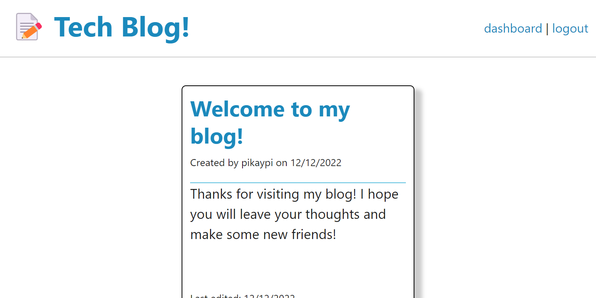
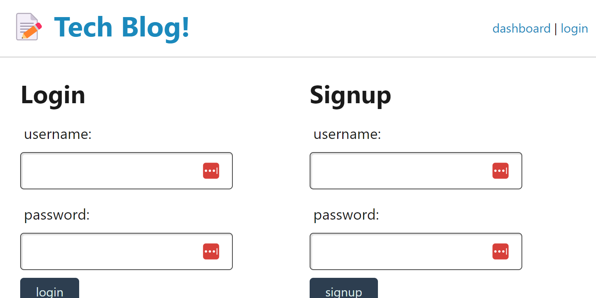
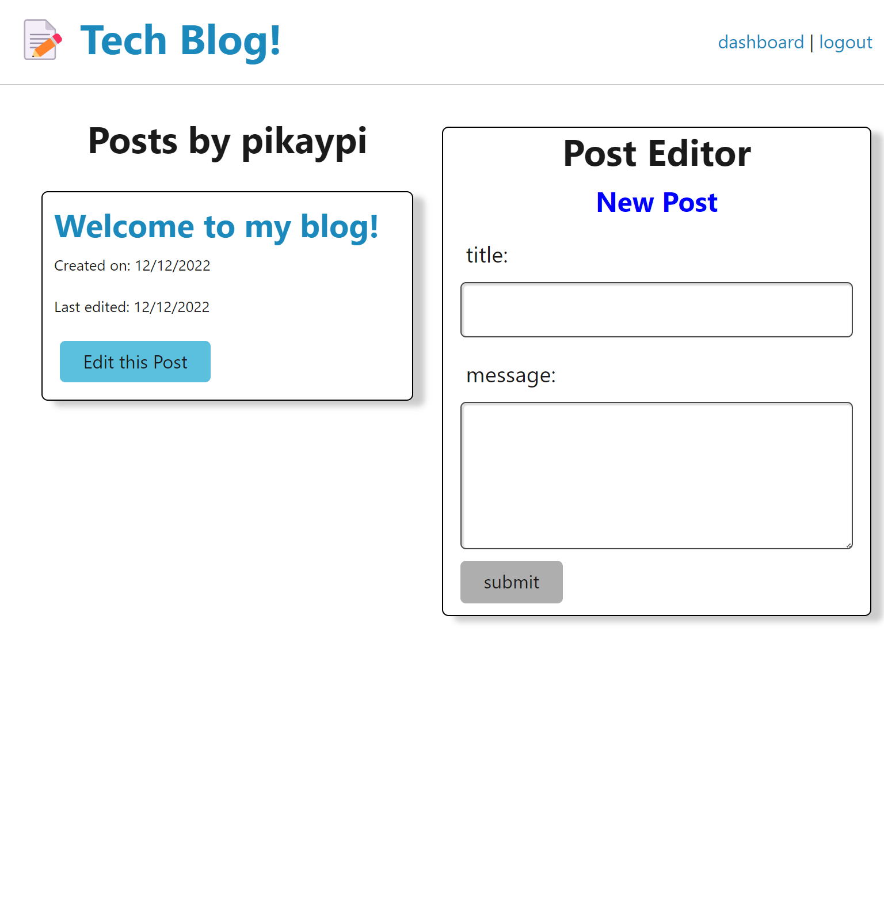
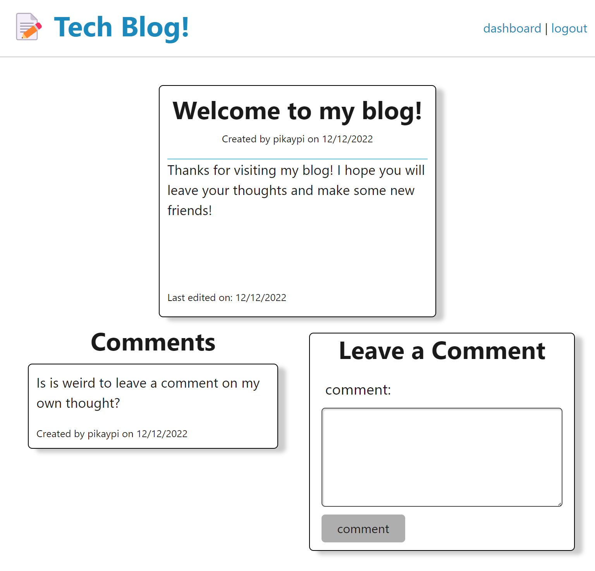

# Tech Blog

## Table of Contents

- [Installation](#installation)
- [Usage](#usage)
- [Test](#tests)
- [Questions](#questions)

---
## Description

---
## Installation
1. Once you have cloned the code repository, open the .env.EXAMPLE file in the root directory and add your mysql password. Save the file and rename it .env
2. Navigate in the terminal into the root directory. Execute ```npm install``` to download the node dependencies and then ```npm run start``` to start the server.
3. (Optional)  If you would like use the included seed data for the blog, with the server running, open a new terminal, navigate to the root directory, and execute ```npm run seed```. Note that every time the server starts, the database clears so be careful turning the server on and off!

---
## Usage

### Homepage
>
> - The navbar will always hold a link to the homepage (click on the Tech Blog! banner), a link to your own dashboard, and a link to either login or logout.
> - If a user tries to access any posts or their dashboard while not logged in, they will be automatically redirected to the login/signup page
### Login/Signup
>
> - If a user already has an account, they can sign in on the left. If their credentials are accepted they will be redirected to the homepage, but all password authentication required link will now redirect to their respective pages.
> - If a user does not have an account, they can sign up on the right. Just like logging in, if their credentials are accepted they will be redirected to the homepage, but all password authentication required link will now redirect to their respective pages as they will be logged in to their new account.

### Dashboard
>
> - Once logged in, a user may access their dashboard by clicking the dashboard link in the upper right hand corner of the page.
> - Once on the dahsboard page, the user's posts will be listed in a column on the left, and an editor to create a new post will be on the left
> - To create a new message, the user must provide a title and message before submitting.
> - To edit a post, the user clicks the "Edit this Post" button for the post they would like to edit and the content of that post will be loaded into the editor. The submit button will submit any changes the user makes to the post, the cancel button will clear the editor and submit no changes to the post, and the delete button will remove the post from the database.

### Post
>
> - The page to view a single post can be accessed by clicking on the title of a post either on the homepage or on the dashboard.
> - The post itself will be displayed at the top of the page, the comments associated with the post at the bottom left, and the editor to add a comment at the bottom right.
> - To add a comment to the post, the user enters their comment text into the editor and clicks the submit button.

---
## Tests
There are currently no test for this application.

---
## Questions
[https://github.com/pikaypi](https://github.com/pikaypi)

---

